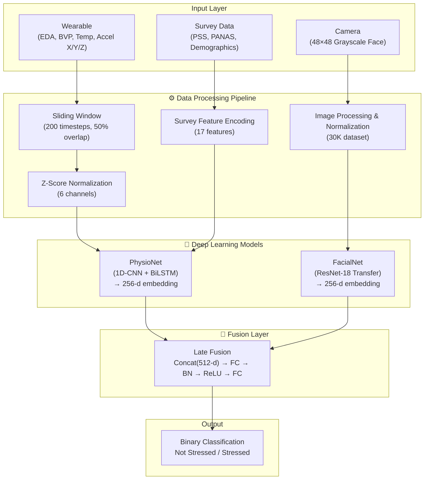
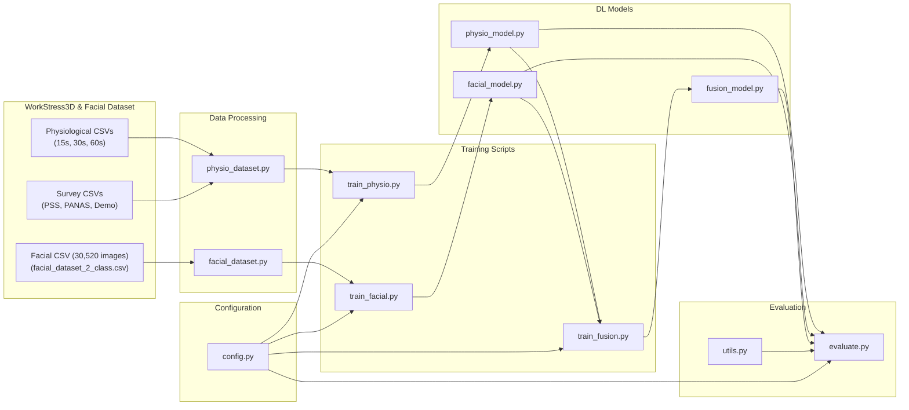
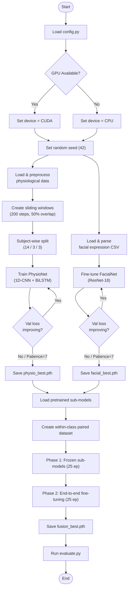

# Neural Palp — Multimodal Stress Detection System

Neural Palp is a deep-learning-based multimodal stress detection system that fuses **physiological signals** (EDA, BVP, Temperature, Accelerometer) captured from wearable sensors with **facial expression analysis** from camera inputs. The system classifies a subject's state as **Stressed** or **Not Stressed** (binary classification) using a late-fusion neural network architecture.

It also contains a real-time data collection pipeline integrated with Firebase, webcam capture, and audio recording.

---

## 📁 Project Directory Structure

```
D:\Capstone\
├── config.py                  # Central configuration (hyperparams, paths, device)
├── utils.py                   # EarlyStopping, metrics, and plotting helpers
├── requirements.txt           # Python dependencies
├── README.md                  # Project documentation (this file)
├── collect_multimodal_data.py # Real-time sensor, video, and audio data collector
├── serviceAccountKey.json     # Firebase service account credential (gitignored)
│
├── data/
│   ├── __init__.py
│   ├── physio_dataset.py      # Physiological signal loader with sliding windows
│   └── facial_dataset.py      # Facial expression dataset loader (30K images)
│
├── models/
│   ├── __init__.py
│   ├── physio_model.py        # PhysioNet (1D-CNN + BiLSTM + Survey integration)
│   ├── facial_model.py        # FacialNet (ResNet-18 Transfer Learning)
│   └── fusion_model.py        # FusionNet (Late Fusion Model)
│
├── train_physio.py            # PhysioNet training script
├── train_facial.py            # FacialNet training script
├── train_fusion.py            # FusionNet two-phase training script
├── evaluate.py                # Unified evaluation script (metrics, confusion matrix, ROC)
│
├── checkpoints/               # Directory for saving best trained models (gitignored)
│   ├── physio_best.pth        # Trained PhysioNet weights (~2.9 MB)
│   ├── facial_best.pth        # Trained FacialNet weights (~45 MB)
│   └── fusion_best.pth        # Trained FusionNet weights (~49 MB)
│
├── plots/                     # Generated training curves & evaluation heatmaps
│   ├── physio_training_curves.png
│   ├── physio_confusion_matrix.png
│   ├── physio_roc_curve.png
│   ├── facial_training_curves.png
│   ├── facial_confusion_matrix.png
│   ├── facial_roc_curve.png
│   ├── fusion_training_curves.png
│   ├── fusion_confusion_matrix.png
│   └── fusion_roc_curve.png
│
├── dataset/                   # Directory where real-time collected data is saved
│   ├── collected_data.csv     # Logged sensor values and timestamps
│   ├── photos/                # Webcam images captured during recording session
│   └── audio/                 # Recorded microphone audio (.wav files)
│
└── Stress analysis from physiological data under pressure WorkStress3D Dataset/ (gitignored)
    ├── PhysiologicalSignals/   (15s, 30s, 60s CSV files)
    ├── TheFacialExpressions/   (facial_expression.csv — 83 images as pixel strings)
    └── Survey/                 (PSS, PANAS, Demographics, Instant Questionnaires)
```

---

## ⚡ System Architecture

### System Block Diagram
The following block diagram demonstrates the end-to-end data pipeline and model flow of the Neural Palp system:



### Component Flow Diagram
Shows how different modules and source files interact across the project:



---

## 🛠️ Technology Stack & Dependencies

The project is built using:
- **Language**: Python 3.8+
- **Deep Learning Framework**: PyTorch $\ge$ 2.0.0
- **Computer Vision**: torchvision $\ge$ 0.15.0 (for ResNet-18 pretrained backbone) & OpenCV $\ge$ 4.8.0
- **Data Engineering**: Pandas, NumPy $\ge$ 1.24.0, SciPy $\ge$ 1.10.0
- **Machine Learning Utilities**: scikit-learn $\ge$ 1.3.0 (Z-score scaling, label encoders, metrics)
- **Visualization**: Matplotlib $\ge$ 3.7.0, Seaborn $\ge$ 0.12.0
- **Hardware Integration & Real-time I/O**: firebase-admin $\ge$ 6.2.0, sounddevice $\ge$ 0.4.6, tqdm $\ge$ 4.65.0

---

## 📊 Data Pipeline Engineering

### 1. Physiological Dataset (`data/physio_dataset.py`)
- **Survey Feature Integration**: Loads demographic information (Gender, Age, Height, Weight, MaritalStatus, SmokingStatus), PSS (Perceived Stress Scale - TotalPoints), and PANAS (Positive and Negative Affect Schedule - 10 features) mapping to **17 total survey features** per subject.
- **Categorical Encoding**: Categorical inputs like Gender, MaritalStatus, and SmokingStatus are converted using `LabelEncoder`.
- **Normalization**: Z-score standardization (`StandardScaler`) is applied globally across physiological channels and survey features.
- **Sliding Window Processing**: Segmented into overlapping sliding windows of `200` timesteps with a `50%` stride (`100` timesteps overlap) for temporal signal capture.
- **Data Partitioning**: Performs a rigorous **Subject-wise split** (Subjects 1-14: Train, 15-17: Validation, 18-20: Test) to avoid data leakage and guarantee that models generalize to unseen individuals.
- **Binary Conversion**: Employs a mapping interface where class `0` (Calm) and `2` (Amusement) represent "Not Stressed" (`0`), while class `1` (Stress) represents "Stressed" (`1`).

### 2. Facial Expression Dataset (`data/facial_dataset.py`)
- **Scale and Source**: Upgraded to use a large-scale **30,520-image** database (`facial_dataset_2_class.csv`).
- **Parsing**: Reads flat pixel arrays of grayscale pixels, reshaping them into standard `48×48` matrices.
- **Data Splitting**: Partitioned based on the original dataset's `Usage` column into distinct splits (`Training` $\rightarrow$ Train, `PublicTest` $\rightarrow$ Validation, `PrivateTest` $\rightarrow$ Test).
- **Transformation Pipeline**: Applies horizontal flipping, random rotations ($\pm 15^\circ$), affine scaling, and color jitter to augment the training set.

---

## 🧠 Deep Learning Models

### 1. PhysioNet (`models/physio_model.py`)
- **Input Dimensions**: Physiological signals (`(batch, 6, 200)`) + Survey feature vector (`(batch, 17)`).
- **Structural Layers**:
  - Three 1D CNN blocks (Conv1D $\rightarrow$ BatchNorm1D $\rightarrow$ ReLU $\rightarrow$ MaxPool1d $\rightarrow$ Dropout) with kernel sizes of `7`, `5`, and `3`.
  - A Bidirectional Long Short-Term Memory (BiLSTM) network (2 layers, 128 hidden units) extracting a `256`-dimensional temporal embedding.
  - Merging layer concatenating the temporal representation with the 17 survey features (`273` total dims).
  - Fully Connected layers projecting down to stress logits.

### 2. FacialNet (`models/facial_model.py`)
- **Input Dimensions**: Grayscale facial image tensors (`(batch, 1, 48, 48)`).
- **Structural Layers**:
  - Modified ResNet-18 backbone. The first conv layer (`conv1`) is adapted from 3 channels (RGB) to 1 channel (grayscale) by averaging pre-trained ImageNet weights.
  - Frozen early blocks (`layer1` and `layer2`) to prevent overfitting.
  - Unfrozen and fine-tuned deep blocks (`layer3` and `layer4`) to identify subtle micro-expressions.
  - Dense head mapping the 512-dimensional output to a `256`-dimensional spatial embedding and predicting stress labels.

### 3. FusionNet (`models/fusion_model.py`)
- **Input Dimensions**: Sub-model embeddings extracted via `get_features()`.
- **Late Fusion Strategy**:
  - Concatenates the `256`-dimensional temporal feature vector (from PhysioNet) and the `256`-dimensional spatial feature vector (from FacialNet) into a `512`-dimensional fused representation.
  - **Fusion Classification Head**:
    ```
    Linear(512 -> 256) -> BatchNorm1d -> ReLU -> Dropout(0.5) -> Linear(256 -> 64) -> ReLU -> Linear(64 -> 2)
    ```

---

## ⚡ Training & Evaluation Pipelines

### Training Activity Pipeline



### FusionNet Two-Phase Training Strategy
Because the sub-models learn features from different domains, FusionNet is trained in two distinct phases:
1. **Phase 1 (Frozen Sub-models)**: The sub-model weights are frozen. Only the fusion classification head is trained for 25 epochs (Learning Rate = `1e-3`). This stabilizes the joint classification boundary.
2. **Phase 2 (End-to-End Fine-Tuning)**: The sub-models are unfrozen (with early ResNet-18 layers remaining frozen) and optimized end-to-end at a lower learning rate (`1e-4`) for another 25 epochs.

**Within-Class Pairing**: The `FusionDataset` generates paired signals. Since physiological and facial samples are recorded asynchronously, it dynamically pairs a physiological window with a random facial image from the *same* binary target class (Stressed vs. Not Stressed).

---

## 🔌 Hardware Integration & Real-time Data Collector

The script `collect_multimodal_data.py` acts as an active recorder for live experiments. It runs multi-threaded tasks to capture data simultaneously from three sources:

1. **Firebase Realtime Database Integration**: 
   - Retrieves live sensor readings from the database path `sensors` (e.g. galvanic skin response `gsr`, core body temperature `temperature`, and 3-axis accelerometer/gyroscope `mpu` values: `ax, ay, az, gx, gy, gz`).
   - Requires setting up a Firebase service account and saving the key in the project root as `serviceAccountKey.json`.
2. **Microphone Audio Capture**:
   - Spawns a background thread using the PyAudio / `sounddevice` library.
   - Records continuous microphone input in WAV format (`44.1kHz`, mono channel) and writes the results to `dataset/audio/`.
3. **Webcam Grabber (Anti-Buffering)**:
   - Implements a dedicated camera grabber thread (`CameraManager`) that queries OpenCV frame captures at 30 FPS.
   - Employs a thread-safe frame access loop to bypass OpenCV's default internal buffer delay, saving a high-definition image to `dataset/photos/` every 10 seconds.
4. **Synthetic Signal Generation**:
   - Generates simulated heart rate (`BPM`) and blood oxygen levels (`SpO2`) values depending on the selected physical condition (`Resting`, `Walking`, `Stress`, `Exercise`) and chronic conditions (`None`, `Heart`, `Lung`, `Both`) using random-walk boundaries.

---

## 🚀 How to Run the Project

### 1. Pre-requisites & Installation
Ensure you have Python 3.8+ installed. Install the dependencies listed in [requirements.txt](file:///d:/Capstone/requirements.txt):

```bash
pip install -r requirements.txt
```

### 2. Live Data Collection (Optional)
To log real-time multimodal experimental records:
1. Save your database credential file as `serviceAccountKey.json` in the root workspace folder.
2. Launch the collector script:
   ```bash
   python collect_multimodal_data.py
   ```
3. Enter participant parameters (name, condition, health state) in the command-line prompts.
4. Press `CTRL + C` to stop the session. Sensor telemetry will save in CSV format, with audio and photographs written in their respective folders.

### 3. Model Training Pipeline
Train the individual networks in order to compile the pretrained weights for the fusion block:

1. **Train PhysioNet** (Saves to `checkpoints/physio_best.pth`):
   ```bash
   python train_physio.py
   ```
2. **Train FacialNet** (Saves to `checkpoints/facial_best.pth`):
   ```bash
   python train_facial.py
   ```
3. **Train FusionNet** (Loads pretrained weights, trains the head, fine-tunes end-to-end, and saves to `checkpoints/fusion_best.pth`):
   ```bash
   python train_fusion.py
   ```

### 4. Unified Performance Evaluation
To print test metrics (Accuracy, F1-Score, Recall, Precision) and export validation plots (ROC Curve, Confusion Matrix) to the `plots/` folder:

```bash
# Evaluate Physiological Model (2-class)
python evaluate.py --model physio

# Evaluate Facial Model (2-class)
python evaluate.py --model facial

# Evaluate late Fusion Model (2-class)
python evaluate.py --model fusion
```

---

## 🔑 Key Design Decisions

- **Differential Learning Rates**: FacialNet uses a `1e-4` learning rate for pretrained backbone layers and `1e-3` for the newly initialized head to ensure deep visual feature extraction is preserved without causing weight disruption.
- **Subject-Wise Splits**: Splits train/val/test data by subjects rather than random index splitting to prevent data leakage and simulate real-world testing.
- **Class Imbalance Control**: Class weights are computed dynamically using inverse frequency and integrated inside the CrossEntropyLoss function.
- **Windows Anti-Multiprocessing**: Disables multi-process PyTorch worker threads (`num_workers=0`) when running on Windows to prevent runtime deadlocks during dataset enumeration.
