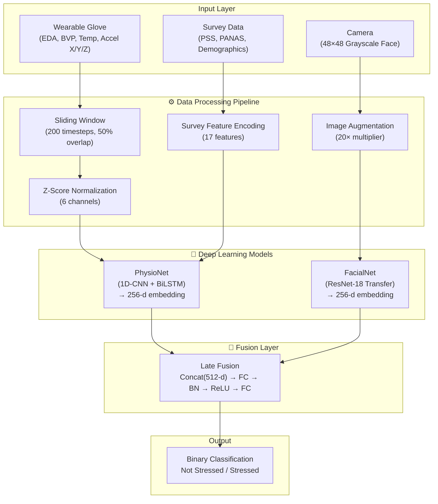
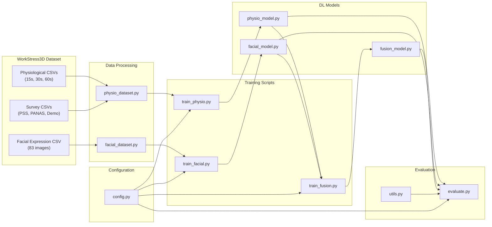
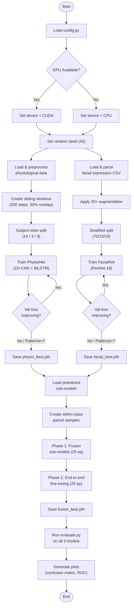

# NeuroBioSense — Multimodal Stress Detection System

NeuroBioSense is a deep-learning-based multimodal stress detection system that fuses **physiological signals** (EDA, BVP, Temperature, Accelerometer) captured from wearable sensors with **facial expression analysis** from camera inputs. The system classifies a subject's state as **Stressed** or **Not Stressed** (binary classification) using a late-fusion neural network architecture.

---

## Project Directory Structure

```
D:\Capstone\
├── config.py                  # Central configuration (hyperparams, paths, device)
├── utils.py                   # EarlyStopping, metrics, and plotting helpers
├── requirements.txt           # Python dependencies
├── README.md                  # Project documentation (this file)
│
├── data/
│   ├── __init__.py
│   ├── physio_dataset.py      # Physiological signal loader with sliding windows
│   └── facial_dataset.py      # Facial expression data loader + augmentation
│
├── models/
│   ├── __init__.py
│   ├── physio_model.py        # PhysioNet (1D-CNN + BiLSTM + Survey integration)
│   ├── facial_model.py        # FacialNet (ResNet-18 Transfer Learning)
│   └── fusion_model.py        # FusionNet (Late Fusion Model)
│
├── train_physio.py            # PhysioNet training script
├── train_facial.py            # FacialNet training script
├── train_fusion.py            # FusionNet two-phase training script
├── evaluate.py                # Unified evaluation script (metrics, confusion matrix, ROC)
│
├── checkpoints/               # Directory for saving best trained models (gitignored)
│   ├── physio_best.pth        # Trained PhysioNet weights (~2.9 MB)
│   ├── facial_best.pth        # Trained FacialNet weights (~45 MB)
│   └── fusion_best.pth        # Trained FusionNet weights (~49 MB)
│
├── plots/                     # Generated training curves & evaluation heatmaps
│   ├── physio_training_curves.png
│   ├── physio_confusion_matrix.png
│   ├── physio_roc_curve.png
│   ├── facial_training_curves.png
│   ├── facial_confusion_matrix.png
│   ├── facial_roc_curve.png
│   ├── fusion_training_curves.png
│   ├── fusion_confusion_matrix.png
│   └── fusion_roc_curve.png
│
└── Stress analysis from physiological data under pressure WorkStress3D Dataset/ (gitignored)
    ├── PhysiologicalSignals/   (15s, 30s, 60s CSV files)
    ├── TheFacialExpressions/   (facial_expression.csv — 83 images as pixel strings)
    └── Survey/                 (PSS, PANAS, Demographics, Instant Questionnaires)
```

---

## System Architecture

### System Block Diagram
The following block diagram demonstrates the end-to-end data pipeline and model flow of the NeuroBioSense system:



### Component Flow Diagram
Shows how different modules and source files interact across the project:



---

## Technology Stack & Dependencies

The project is built using:
- **Language**: Python 3.8+
- **Deep Learning Framework**: PyTorch $\ge$ 2.0.0
- **Computer Vision**: torchvision $\ge$ 0.15.0 (for ResNet-18 pretrained backbone)
- **Data Engineering**: Pandas, NumPy $\ge$ 1.24.0, OpenCV $\ge$ 4.8.0
- **Machine Learning Utilities**: scikit-learn $\ge$ 1.3.0 (Z-score scaling, label encoders)
- **Visualization**: Matplotlib $\ge$ 3.7.0, Seaborn $\ge$ 0.12.0

---

## Deep Learning Models

### 1. PhysioNet (`models/physio_model.py`)
- **Inputs**: Physiological signals (6 channels: EDA, BVP, Temperature, Accelerometer X/Y/Z) and Subject Survey features (17 features: PSS, PANAS, Demographics).
- **Architecture**: 
  - Three 1D convolutional layers with batch normalization, ReLU activation, max pooling, and dropout (0.3).
  - A Bidirectional LSTM (BiLSTM) with 2 layers and 128 hidden units (outputting a 256-dimensional temporal embedding).
  - Concatenation of the 256-d temporal embedding with the 17-d survey features.
  - Fully connected layers classifying into 3 classes: **Calm / Stress / Amusement**.
- **Inference**: Provides a `get_features()` method to extract the raw 256-d signal representation for downstream late fusion.

### 2. FacialNet (`models/facial_model.py`)
- **Inputs**: 48x48 pixel grayscale face images parsed from the dataset.
- **Architecture**:
  - ResNet-18 initialized with pretrained ImageNet weights. The input convolution layer is adapted from 3 channels to 1 channel (averaging weights across channels).
  - Layers 1 and 2 are frozen to leverage general low-level visual features.
  - Layers 3 and 4 are fine-tuned to capture facial expression details specific to stress.
  - A custom classifier head maps features to 2 output classes: **Non-Stress / Stress**.
- **Inference**: Provides a `get_features()` method to extract the raw 256-d spatial embedding.

### 3. FusionNet (`models/fusion_model.py`)
- **Strategy**: Late fusion matching by concatenating representations.
- **Architecture**:
  - Concatenates the 256-d temporal embedding from PhysioNet and 256-d spatial embedding from FacialNet to form a 512-d feature vector.
  - A multi-layer feed-forward neural network with batch normalization, ReLU, and dropout (0.5) outputs predictions for 2 classes: **Not Stressed / Stressed**.

---

## Training & Evaluation Pipelines

### Training Workflow Activity Diagram



### FusionNet Two-Phase Training Strategy
Because the sub-models learn features from different domains, FusionNet is trained in two distinct phases:
1. **Phase 1 (Frozen Sub-models)**: The sub-model weights are frozen. Only the fusion classification head is trained for 25 epochs (Learning Rate = 1e-3). This stabilizes the joint classification boundary.
2. **Phase 2 (End-to-End Fine-Tuning)**: The sub-models are unfrozen (with early ResNet-18 layers remaining frozen) and optimized end-to-end at a lower learning rate (1e-4) for another 25 epochs.

---

## How to Run the Project

### 1. Installation
Install all required dependencies using `pip`:
```bash
pip install -r requirements.txt
```

### 2. Training the Pipeline
You must train the sub-models sequentially so that FusionNet can load their pre-trained weights.

1. **Train PhysioNet**:
   ```bash
   python train_physio.py
   ```
2. **Train FacialNet**:
   ```bash
   python train_facial.py
   ```
3. **Train FusionNet**:
   ```bash
   python train_fusion.py
   ```

### 3. Unified Evaluation
Evaluate the accuracy, precision, recall, and F1 score of any of your models using the `evaluate.py` script. The evaluation also automatically exports confusion matrix and ROC curves to the `plots/` directory:

```bash
# Evaluate Physiological Model (3-class)
python evaluate.py --model physio

# Evaluate Facial Model (2-class)
python evaluate.py --model facial

# Evaluate late Fusion Model (2-class)
python evaluate.py --model fusion
```

---

## Key Design Decisions
1. **Subject-wise Splitting**: Prevents data leakage by ensuring that data from subjects used during training are never present in the validation or test sets (Subject 1-14: Train, 15-17: Validation, 18-20: Test).
2. **Class Imbalance Handling**: Inverse-frequency weights are dynamically calculated and applied to the loss functions of all three networks.
3. **Data Augmentation**: Grayscale face datasets are augmented 20-fold using horizontal flips, random rotations, affine translations, and scaling to resolve the constraints of the small image subset (83 samples).
4. **Early Stopping**: All training runs utilize an `EarlyStopping` utility tracking validation loss (patience=7) to prevent overfitting.
