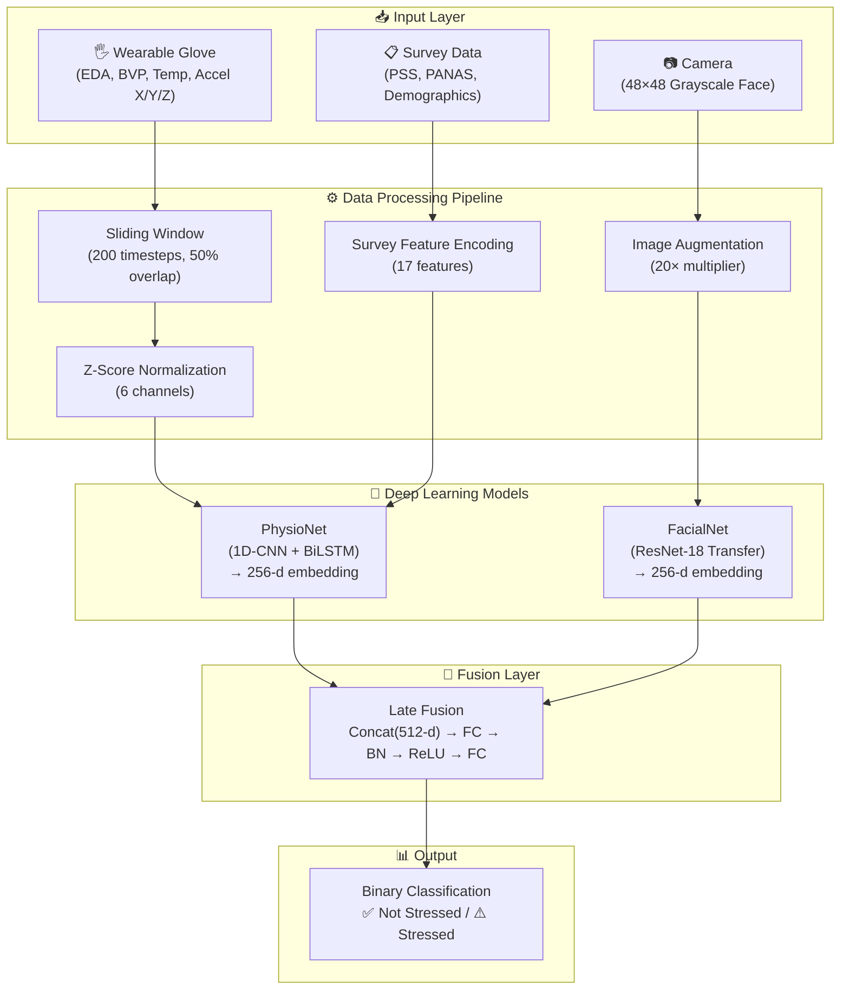
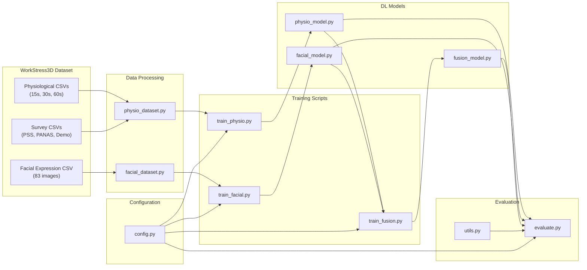
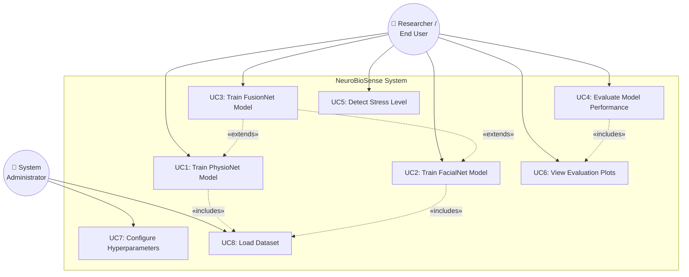
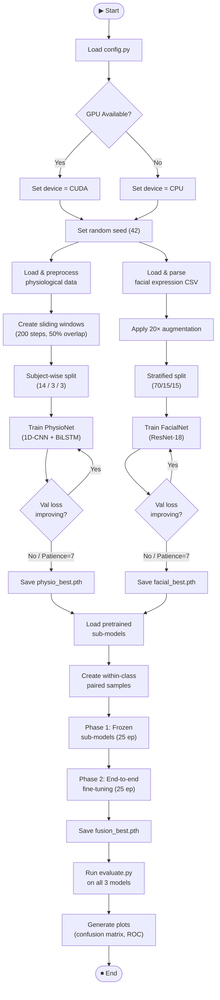
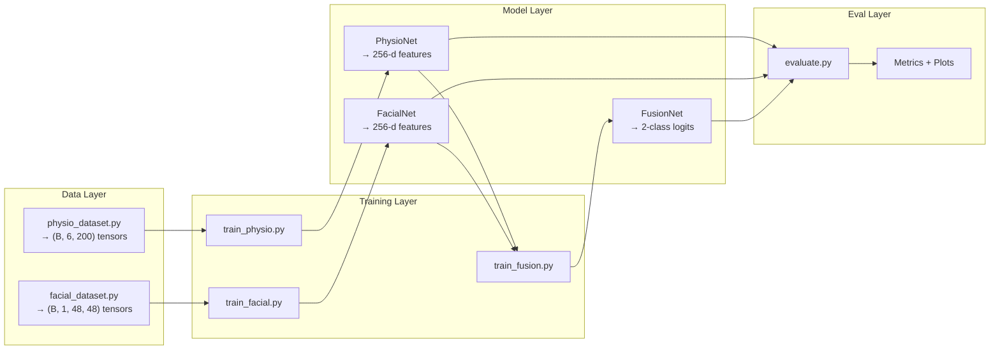
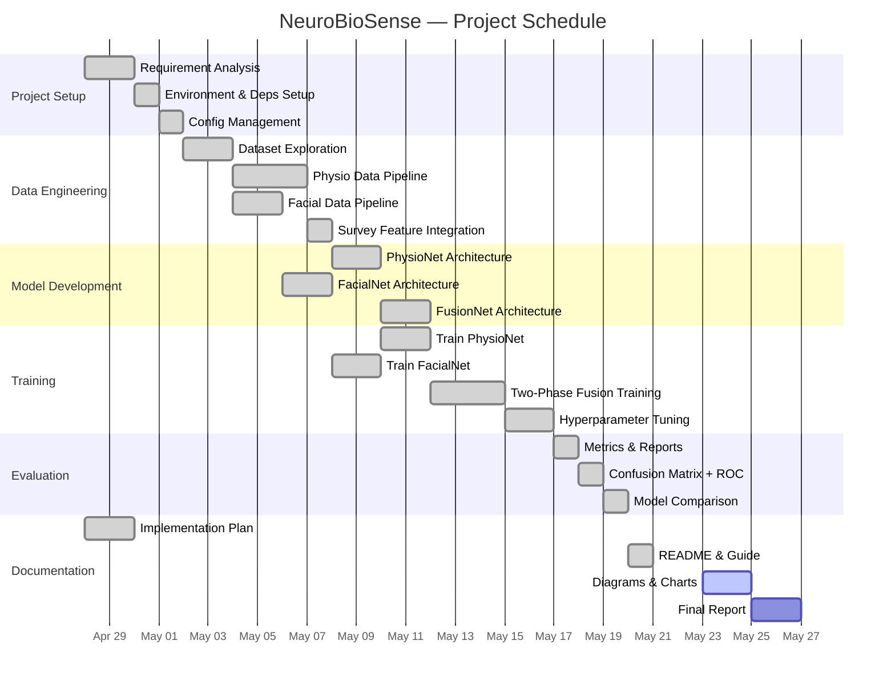
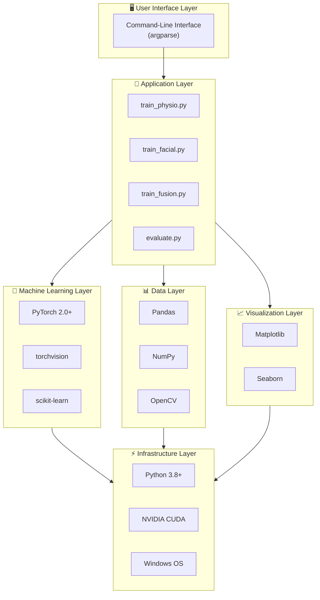

# NeuroBioSense — Multimodal Stress Detection System
# Complete Project Documentation

---

## 1. Product Perspective — Block Diagram

### 1.1 Product Overview
NeuroBioSense is a deep-learning-based multimodal stress detection system that fuses **physiological signals** (EDA, BVP, Temperature, Accelerometer) captured from wearable sensors with **facial expression analysis** from camera input. The system classifies a subject as **Stressed** or **Not Stressed** in real-time using a late-fusion neural network architecture.

### 1.2 System Block Diagram

### 1.3 Component Block Diagram

---

## 2. Use Case Diagrams

### 2.1 Use Case Diagram

### 2.2 Use Case Templates

#### UC1: Train PhysioNet Model

| Field | Description |
|-------|-------------|
| **Use Case ID** | UC1 |
| **Name** | Train PhysioNet Model |
| **Actor** | Researcher |
| **Pre-Conditions** | WorkStress3D dataset available; `config.py` configured; Dependencies installed |
| **Normal Flow** | 1. User runs `python train_physio.py` → 2. System loads 60s physiological CSV → 3. Creates sliding windows (200 steps, 50% overlap) → 4. Applies subject-wise split (1–14 train, 15–17 val, 18–20 test) → 5. Trains 1D-CNN+BiLSTM with weighted loss → 6. Early stopping monitors val loss → 7. Saves best model to `checkpoints/physio_best.pth` |
| **Alternate Flow** | A1: CUDA unavailable → falls back to CPU training. A2: Early stopping triggers before max epochs. |
| **Extension Points** | Checkpoint used by UC3 (FusionNet training) |
| **Post-Conditions** | `physio_best.pth` saved; training curves plotted |

#### UC2: Train FacialNet Model

| Field | Description |
|-------|-------------|
| **Use Case ID** | UC2 |
| **Name** | Train FacialNet Model |
| **Actor** | Researcher |
| **Pre-Conditions** | Facial expression CSV available (83 images) |
| **Normal Flow** | 1. User runs `python train_facial.py` → 2. Parses pixel strings → 48×48 images → 3. Applies 20× augmentation → 4. Fine-tunes ResNet-18 (layers 3-4) with differential LR → 5. Saves best to `checkpoints/facial_best.pth` |
| **Alternate Flow** | A1: Augmentation multiplier adjusted if memory insufficient |
| **Extension Points** | Checkpoint used by UC3 |
| **Post-Conditions** | `facial_best.pth` saved; training curves plotted |

#### UC3: Train FusionNet Model

| Field | Description |
|-------|-------------|
| **Use Case ID** | UC3 |
| **Name** | Train FusionNet (Late Fusion) |
| **Actor** | Researcher |
| **Pre-Conditions** | Both `physio_best.pth` and `facial_best.pth` must exist |
| **Normal Flow** | 1. User runs `python train_fusion.py` → 2. Loads pretrained sub-models → 3. Creates within-class paired samples → 4. Phase 1: Frozen sub-models, trains fusion head (25 epochs) → 5. Phase 2: Unfreezes for end-to-end fine-tuning (25 epochs) → 6. Saves best to `fusion_best.pth` |
| **Alternate Flow** | A1: Missing checkpoint → prints error and exits |
| **Extension Points** | None |
| **Post-Conditions** | `fusion_best.pth` saved; combined training curves plotted |

#### UC4: Evaluate Model Performance

| Field | Description |
|-------|-------------|
| **Use Case ID** | UC4 |
| **Name** | Evaluate Model |
| **Actor** | Researcher |
| **Pre-Conditions** | Trained checkpoint exists for selected model |
| **Normal Flow** | 1. User runs `python evaluate.py --model {physio\|facial\|fusion}` → 2. Loads checkpoint → 3. Runs inference on test set → 4. Computes accuracy, precision, recall, F1 → 5. Generates confusion matrix + ROC curve PNGs |
| **Alternate Flow** | A1: Checkpoint missing → raises FileNotFoundError |
| **Extension Points** | None |
| **Post-Conditions** | Metrics printed; plots saved to `plots/` |

---

## 3. Complete Tasks and Subtasks

| # | Task | Subtasks |
|---|------|----------|
| **T1** | **Project Setup** | T1.1 Set up Python environment · T1.2 Install dependencies · T1.3 Configure paths in `config.py` · T1.4 Verify GPU availability |
| **T2** | **Dataset Analysis** | T2.1 Explore physiological CSVs (15s/30s/60s) · T2.2 Analyze class distribution · T2.3 Explore facial expression data · T2.4 Parse survey files |
| **T3** | **Physio Data Pipeline** | T3.1 Load & standardize CSVs · T3.2 Implement sliding windows · T3.3 Z-score normalization · T3.4 Subject-wise splitting · T3.5 Survey feature integration |
| **T4** | **Facial Data Pipeline** | T4.1 Parse pixel strings to images · T4.2 Implement 20× augmentation · T4.3 Stratified train/val/test split · T4.4 Normalize to [0,1] |
| **T5** | **PhysioNet Model** | T5.1 Build Conv1D blocks · T5.2 Implement BiLSTM layer · T5.3 Survey feature concatenation · T5.4 Feature extraction method |
| **T6** | **FacialNet Model** | T6.1 Adapt ResNet-18 for grayscale · T6.2 Freeze early layers · T6.3 Custom classification head · T6.4 Feature extraction method |
| **T7** | **FusionNet Model** | T7.1 Concatenation layer · T7.2 Fusion head FC layers · T7.3 Freeze/unfreeze methods · T7.4 Pretrained weight loading |
| **T8** | **Training Pipeline** | T8.1 Train PhysioNet · T8.2 Train FacialNet · T8.3 Two-phase FusionNet training · T8.4 Early stopping + checkpointing |
| **T9** | **Evaluation Pipeline** | T9.1 Test set inference · T9.2 Classification metrics · T9.3 Confusion matrix plots · T9.4 ROC curve plots |
| **T10** | **Documentation** | T10.1 Implementation plan · T10.2 Project summary · T10.3 README · T10.4 Diagrams & charts |

---

## 4. Swimlane / Activity Diagram

### 4.1 Training Pipeline Activity Diagram

### 4.2 Swimlane Diagram — Data Flow Across Modules

---

## 5. Work Breakdown Structure (WBS)

```mermaid
graph TD
    ROOT["NeuroBioSense<br/>Multimodal Stress Detection"]

    ROOT --> WP1["WP1: Project<br/>Management"]
    ROOT --> WP2["WP2: Data<br/>Engineering"]
    ROOT --> WP3["WP3: Model<br/>Development"]
    ROOT --> WP4["WP4: Training<br/>& Optimization"]
    ROOT --> WP5["WP5: Evaluation<br/>& Validation"]
    ROOT --> WP6["WP6: Documentation<br/>& Delivery"]

    WP1 --> W1A["1.1 Requirement<br/>Analysis"]
    WP1 --> W1B["1.2 Environment<br/>Setup"]
    WP1 --> W1C["1.3 Configuration<br/>Management"]

    WP2 --> W2A["2.1 Dataset<br/>Exploration"]
    WP2 --> W2B["2.2 Physio<br/>Pipeline"]
    WP2 --> W2C["2.3 Facial<br/>Pipeline"]
    WP2 --> W2D["2.4 Survey<br/>Integration"]

    WP3 --> W3A["3.1 PhysioNet<br/>(CNN+BiLSTM)"]
    WP3 --> W3B["3.2 FacialNet<br/>(ResNet-18)"]
    WP3 --> W3C["3.3 FusionNet<br/>(Late Fusion)"]

    WP4 --> W4A["4.1 PhysioNet<br/>Training"]
    WP4 --> W4B["4.2 FacialNet<br/>Training"]
    WP4 --> W4C["4.3 Two-Phase<br/>Fusion Training"]
    WP4 --> W4D["4.4 Hyperparameter<br/>Tuning"]

    WP5 --> W5A["5.1 Metrics<br/>Computation"]
    WP5 --> W5B["5.2 Confusion<br/>Matrices"]
    WP5 --> W5C["5.3 ROC<br/>Curves"]
    WP5 --> W5D["5.4 Model<br/>Comparison"]

    WP6 --> W6A["6.1 Implementation<br/>Plan"]
    WP6 --> W6B["6.2 README &<br/>User Guide"]
    WP6 --> W6C["6.3 Diagrams &<br/>Charts"]
    WP6 --> W6D["6.4 Final<br/>Report"]
```

---

## 6. Gantt Chart — Task Scheduling

---

## 7. Requirements Classification

### 7.1 Functional Requirements

| ID | Requirement | Priority |
|----|-------------|----------|
| FR-01 | System shall load and preprocess physiological CSV data (EDA, BVP, Temp, Accel) with sliding windows | High |
| FR-02 | System shall parse 48×48 pixel strings from facial expression CSV into image tensors | High |
| FR-03 | System shall integrate survey features (PSS, PANAS, Demographics — 17 total) per subject | High |
| FR-04 | System shall perform subject-wise data splitting to prevent data leakage | High |
| FR-05 | System shall train PhysioNet (1D-CNN + BiLSTM) for 3-class physiological stress classification | High |
| FR-06 | System shall train FacialNet (ResNet-18) for binary facial stress classification with 20× augmentation | High |
| FR-07 | System shall train FusionNet via two-phase strategy (frozen → end-to-end) | High |
| FR-08 | System shall implement early stopping with patience=7 and checkpoint saving | Medium |
| FR-09 | System shall evaluate models with accuracy, precision, recall, F1, confusion matrix, and ROC curves | High |
| FR-10 | System shall support CLI-based model selection for evaluation (`--model physio\|facial\|fusion`) | Medium |

### 7.2 Non-Functional Requirements

| ID | Requirement | Category |
|----|-------------|----------|
| NFR-01 | Training shall complete within reasonable time using GPU acceleration (CUDA) | Performance |
| NFR-02 | System shall be reproducible via fixed random seed (42) | Reliability |
| NFR-03 | Models shall achieve >85% accuracy on physiological and >70% on facial data | Performance |
| NFR-04 | Checkpoints shall be saved in portable `.pth` format (<50 MB each) | Portability |
| NFR-05 | System shall handle class imbalance via weighted loss functions | Robustness |
| NFR-06 | System shall run on Windows with Python 3.8+ | Compatibility |
| NFR-07 | All plots shall be saved as high-resolution PNG (150 DPI) | Usability |
| NFR-08 | Code shall be modular with separate config, data, models, and training modules | Maintainability |

### 7.3 External Interface Requirements — APIs & Libraries

| Interface | Library/API | Version | Purpose |
|-----------|-------------|---------|---------|
| Deep Learning Framework | PyTorch | ≥2.0.0 | Model building, training, inference |
| Computer Vision | torchvision | ≥0.15.0 | ResNet-18 pretrained model, transforms |
| Numerical Computing | NumPy | ≥1.24.0 | Array operations, data manipulation |
| Data Processing | Pandas | ≥2.0.0 | CSV loading, dataframe operations |
| ML Utilities | scikit-learn | ≥1.3.0 | Metrics, label encoding, normalization |
| Plotting | Matplotlib | ≥3.7.0 | Training curves, ROC plots |
| Heatmaps | Seaborn | ≥0.12.0 | Confusion matrix visualization |
| Progress Bars | tqdm | ≥4.65.0 | Training progress display |
| Image Processing | OpenCV | ≥4.8.0 | Image manipulation utilities |

---

## 8. Components to be Procured

### 8.1 Hardware Components

| # | Component | Specification | Purpose |
|---|-----------|---------------|---------|
| 1 | **GPU Workstation** | NVIDIA CUDA-capable GPU (≥4GB VRAM) | Model training acceleration |
| 2 | **Wearable Sensor Glove** | EDA + BVP + Temperature + 3-axis Accelerometer | Real-time physiological data capture |
| 3 | **Camera Module** | Minimum 480p, grayscale capable | Facial expression capture |
| 4 | **Storage** | ≥10 GB SSD | Dataset + checkpoints + plots |

### 8.2 Software Components

| # | Component | Source | License |
|---|-----------|--------|---------|
| 1 | Python 3.8+ | python.org | PSF |
| 2 | PyTorch 2.0+ | pytorch.org | BSD |
| 3 | torchvision | pytorch.org | BSD |
| 4 | ResNet-18 Pretrained Weights | ImageNet / torchvision | MIT |
| 5 | scikit-learn | scikit-learn.org | BSD |
| 6 | CUDA Toolkit | NVIDIA | Proprietary (free) |

### 8.3 Dataset

| # | Dataset | Source | Size |
|---|---------|--------|------|
| 1 | **WorkStress3D** | Research dataset | 20 subjects |
| 2 | — Physiological Signals | 3 CSV files (15s/30s/60s) | 168K samples (60s) |
| 3 | — Facial Expressions | 1 CSV (pixel strings) | 83 images |
| 4 | — Survey Data | 4 CSV files (PSS, PANAS, Demo, Instant) | 20 subjects |

---

## 9. Technology Stack

### Technology Stack Summary Table

| Layer | Technology | Version | Role |
|-------|-----------|---------|------|
| **Language** | Python | 3.8+ | Core programming language |
| **DL Framework** | PyTorch | ≥2.0.0 | Neural network training & inference |
| **Transfer Learning** | torchvision (ResNet-18) | ≥0.15.0 | Pretrained CNN backbone |
| **Data Processing** | Pandas + NumPy | ≥2.0 / ≥1.24 | CSV loading, array ops |
| **ML Utilities** | scikit-learn | ≥1.3.0 | Metrics, encoding, normalization |
| **Visualization** | Matplotlib + Seaborn | ≥3.7 / ≥0.12 | Plots, heatmaps, curves |
| **Image Processing** | OpenCV | ≥4.8.0 | Image utilities |
| **GPU Acceleration** | NVIDIA CUDA | 11.x / 12.x | GPU-accelerated training |
| **OS** | Windows | 10/11 | Development platform |
| **Version Control** | Git + GitHub | Latest | Source code management |

### Key Architectural Decisions

| Decision | Rationale |
|----------|-----------|
| **Late Fusion** over Early Fusion | Allows each modality to learn independent representations before combining |
| **ResNet-18** over larger models | Sufficient for 48×48 grayscale; avoids overfitting on 83 images |
| **1D-CNN + BiLSTM** for physio | CNN extracts local patterns; BiLSTM captures temporal dependencies |
| **Two-Phase Training** | Phase 1 stabilizes fusion head; Phase 2 jointly optimizes all parameters |
| **Subject-wise Split** | Prevents data leakage — no subject in both train and test sets |
| **20× Augmentation** | Compensates for extremely small facial dataset (83 images) |
| **PyTorch** over TensorFlow | Better research flexibility; native CUDA support on Windows |
